Theneo API Reference

[Theneo API Reference](#theneo-api-reference)

[Authentication](#authentication)

[Customers](#customers)

[Create order](#create-order)

[Errors](#errors)

[SDK Example](#errors)

+----------------------------------------------------------------------------------------------------------------------------------------------------------------------------------------------------------------------------------------------------------------------------------------------------------------------------------------------------------------------+-----------------------------------------------------------------------------------+
| # Theneo API Reference                                                                                                                                                                                                                                                                                                                                               |                                                                                   |
|                                                                                                                                                                                                                                                                                                                                                                      |                                                                                   |
| Theneo APIs enable you to generate beautiful API documentation effortlessly. Why should only top companies like Stripe, Square, and Twilio have gorgeous documentation? With Theneo you can also generate API documents that you could be proud of.                                                                                                                  |                                                                                   |
|                                                                                                                                                                                                                                                                                                                                                                      |                                                                                   |
| The Theneo API follows the general patterns of REST.                                                                                                                                                                                                                                                                                                                 |                                                                                   |
|                                                                                                                                                                                                                                                                                                                                                                      |                                                                                   |
| Please note: All the endpoints and API references discussed here are just for demo purposes, they are not functional.                                                                                                                                                                                                                                                |                                                                                   |
|                                                                                                                                                                                                                                                                                                                                                                      |                                                                                   |
| {width="6.875757874015748in" height="1.7501924759405074in"}                                                                                                                                                                                                                                                                                     |                                                                                   |
|                                                                                                                                                                                                                                                                                                                                                                      |                                                                                   |
| 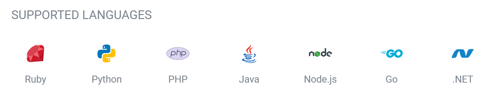{width="6.801675415573054in" height="1.3427405949256344in"}                                                                                                                                                                                                                                                                                     |                                                                                   |
+======================================================================================================================================================================================================================================================================================================================================================================+===================================================================================+
| # Authentication                                                                                                                                                                                                                                                                                                                                                     |                                                                                   |
|                                                                                                                                                                                                                                                                                                                                                                      |                                                                                   |
| The Theneo API uses secure authentication via OAuth 2.0 Authorization, specifically bearer tokens in every API request. Your admin username and API key are used to authenticate requests and generate the bearer token.                                                                                                                                             |                                                                                   |
|                                                                                                                                                                                                                                                                                                                                                                      |                                                                                   |
| Your API keys carry many privileges, so be sure to keep them secure! Do not share your secret API keys.                                                                                                                                                                                                                                                              |                                                                                   |
|                                                                                                                                                                                                                                                                                                                                                                      |                                                                                   |
| 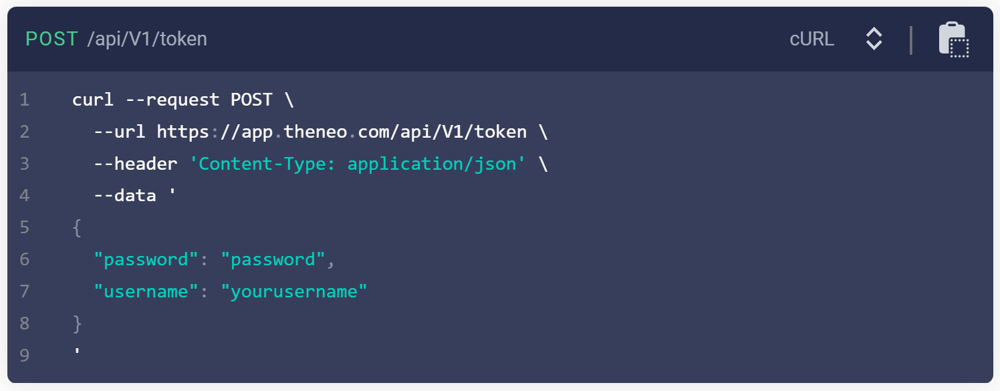{width="6.926689632545932in" height="2.7086318897637796in"}                                                                                                                                                                                                                                                                                     |                                                                                   |
|                                                                                                                                                                                                                                                                                                                                                                      |                                                                                   |
| {width="6.959099956255468in" height="2.634549431321085in"}                                                                                                                                                                                                                                                                                      |                                                                                   |
+----------------------------------------------------------------------------------------------------------------------------------------------------------------------------------------------------------------------------------------------------------------------------------------------------------------------------------------------------------------------+-----------------------------------------------------------------------------------+
| # Customers                                                                                                                                                                                                                                                                                                                                                          |                                                                                   |
|                                                                                                                                                                                                                                                                                                                                                                      |                                                                                   |
| Create and manage customer profiles and sync CRM systems with Theneo.                                                                                                                                                                                                                                                                                                |                                                                                   |
|                                                                                                                                                                                                                                                                                                                                                                      |                                                                                   |
| The Customers API enables you to create and manage customer profiles, as well as search for customers based on\                                                                                                                                                                                                                                                      |                                                                                   |
| various criteria (including customer group membership). You can also use the API to sync contacts between your CRM\                                                                                                                                                                                                                                                  |                                                                                   |
| system and Theneo.                                                                                                                                                                                                                                                                                                                                                   |                                                                                   |
+----------------------------------------------------------------------------------------------------------------------------------------------------------------------------------------------------------------------------------------------------------------------------------------------------------------------------------------------------------------------+-----------------------------------------------------------------------------------+
| # Create Customer                                                                                                                                                                                                                                                                                                                                                    |                                                                                   |
|                                                                                                                                                                                                                                                                                                                                                                      |                                                                                   |
| **POST** /v2/customers\                                                                                                                                                                                                                                                                                                                                              |                                                                                   |
| Creates a new customer for a business.                                                                                                                                                                                                                                                                                                                               |                                                                                   |
|                                                                                                                                                                                                                                                                                                                                                                      |                                                                                   |
| You must provide at least one of the following values in your request to this endpoint:                                                                                                                                                                                                                                                                              |                                                                                   |
|                                                                                                                                                                                                                                                                                                                                                                      |                                                                                   |
| given_name\                                                                                                                                                                                                                                                                                                                                                          |                                                                                   |
| family_name\                                                                                                                                                                                                                                                                                                                                                         |                                                                                   |
| company_name\                                                                                                                                                                                                                                                                                                                                                        |                                                                                   |
| email_address                                                                                                                                                                                                                                                                                                                                                        |                                                                                   |
|                                                                                                                                                                                                                                                                                                                                                                      |                                                                                   |
| 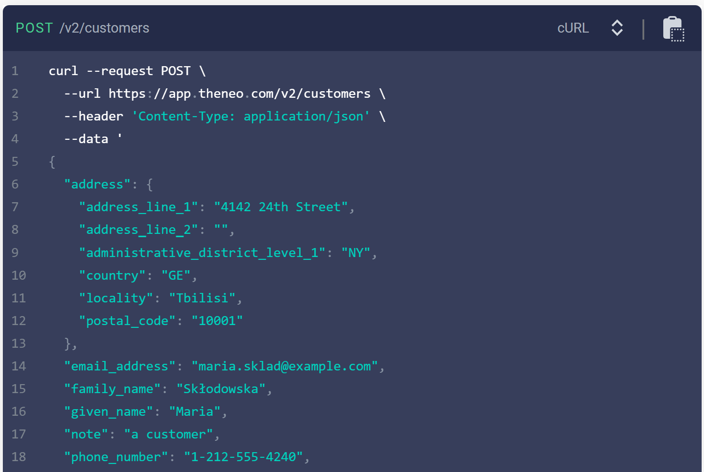{width="6.8949573490813645in" height="4.6258103674540685in"}                                                                                                                                                                                                                                                                                    |                                                                                   |
|                                                                                                                                                                                                                                                                                                                                                                      |                                                                                   |
| {width="6.894278215223097in" height="0.6945209973753281in"}                                                                                                                                                                                                                                                                                     |                                                                                   |
+----------------------------------------------------------------------------------------------------------------------------------------------------------------------------------------------------------------------------------------------------------------------------------------------------------------------------------------------------------------------+-----------------------------------------------------------------------------------+
| # List Customers                                                                                                                                                                                                                                                                                                                                                     | 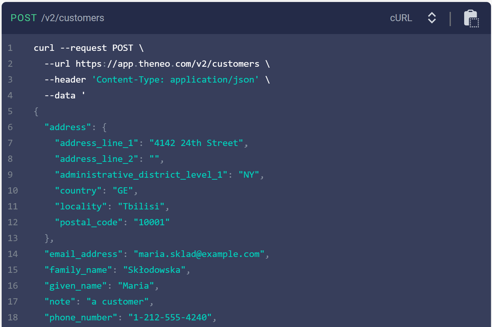{width="6.875757874015748in" height="0.7084109798775153in"} |
|                                                                                                                                                                                                                                                                                                                                                                      |                                                                                   |
| **GET** /v2/customers\                                                                                                                                                                                                                                                                                                                                               |                                                                                   |
| Lists customer profiles associated with a Theneo account.                                                                                                                                                                                                                                                                                                            |                                                                                   |
|                                                                                                                                                                                                                                                                                                                                                                      |                                                                                   |
| Under normal operating conditions, newly created or updated customer profiles become available for the listing operation in well under 30 seconds. Occasionally, propagation of the new or updated profiles can take closer to one minute or longer, especially during network incidents and outages.                                                                |                                                                                   |
|                                                                                                                                                                                                                                                                                                                                                                      |                                                                                   |
| {width="6.834086832895888in" height="1.1019728783902012in"}                                                                                                                                                                                                                                                                                     |                                                                                   |
|                                                                                                                                                                                                                                                                                                                                                                      |                                                                                   |
| 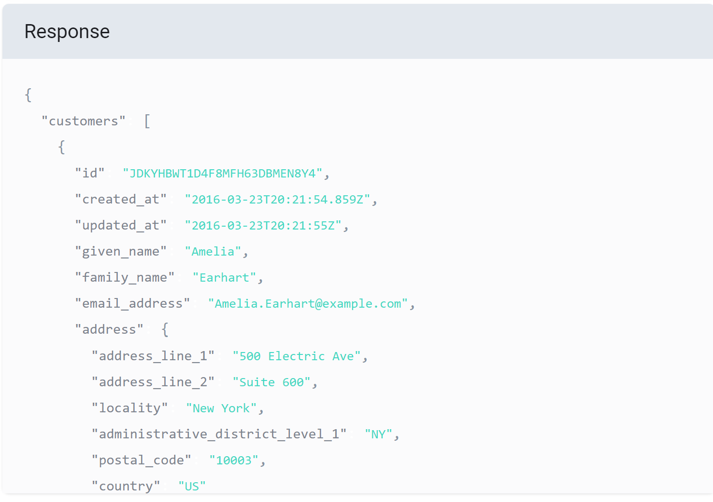{width="6.834086832895888in" height="4.819975940507437in"}                                                                                                                                                                                                                                                                                      |                                                                                   |
|                                                                                                                                                                                                                                                                                                                                                                      |                                                                                   |
| 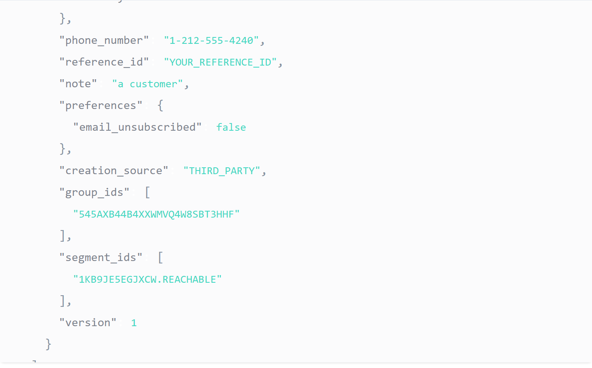{width="6.801675415573054in" height="4.236578083989501in"}                                                                                                                                                                                                                                                                                      |                                                                                   |
|                                                                                                                                                                                                                                                                                                                                                                      |                                                                                   |
| {width="6.875757874015748in" height="0.7084109798775153in"}                                                                                                                                                                                                                                                                                    |                                                                                   |
+----------------------------------------------------------------------------------------------------------------------------------------------------------------------------------------------------------------------------------------------------------------------------------------------------------------------------------------------------------------------+-----------------------------------------------------------------------------------+
| # Update Customer                                                                                                                                                                                                                                                                                                                                                    |                                                                                   |
|                                                                                                                                                                                                                                                                                                                                                                      |                                                                                   |
| PUT /v2/customers/{customer_id}\                                                                                                                                                                                                                                                                                                                                     |                                                                                   |
| Updates a customer profile.                                                                                                                                                                                                                                                                                                                                          |                                                                                   |
|                                                                                                                                                                                                                                                                                                                                                                      |                                                                                   |
| To change an attribute, specify the new value. To remove an attribute, specify the value as an empty string or empty object.                                                                                                                                                                                                                                         |                                                                                   |
|                                                                                                                                                                                                                                                                                                                                                                      |                                                                                   |
| As a best practice, you should include the version field in the request to enable optimistic concurrency control. The value must be set to the current version of the customer profile.                                                                                                                                                                              |                                                                                   |
|                                                                                                                                                                                                                                                                                                                                                                      |                                                                                   |
| To update a customer profile that was created by merging existing profiles, you must use the ID of the newly created profile.                                                                                                                                                                                                                                        |                                                                                   |
|                                                                                                                                                                                                                                                                                                                                                                      |                                                                                   |
| **Path Parameters**                                                                                                                                                                                                                                                                                                                                                  |                                                                                   |
|                                                                                                                                                                                                                                                                                                                                                                      |                                                                                   |
|    customer_id^string **REQUIRED\  **\  ^The ID of the customer to update.                                                                                                                                                                                                                                                                                           |                                                                                   |
|                                                                                                                                                                                                                                                                                                                                                                      |                                                                                   |
| {width="6.875757874015748in" height="4.583838582677165in"}                                                                                                                                                                                                                                                                                     |                                                                                   |
|                                                                                                                                                                                                                                                                                                                                                                      |                                                                                   |
| 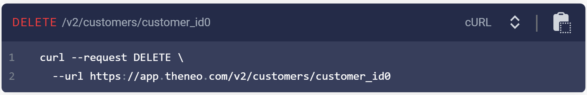{width="6.861866797900262in" height="0.7686034558180227in"}                                                                                                                                                                                                                                                                                    |                                                                                   |
+----------------------------------------------------------------------------------------------------------------------------------------------------------------------------------------------------------------------------------------------------------------------------------------------------------------------------------------------------------------------+-----------------------------------------------------------------------------------+
| # Delete Customer                                                                                                                                                                                                                                                                                                                                                    |                                                                                   |
|                                                                                                                                                                                                                                                                                                                                                                      |                                                                                   |
| DELETE /v2/customers/{customer_id}\                                                                                                                                                                                                                                                                                                                                  |                                                                                   |
| Deletes a customer profile from a business.                                                                                                                                                                                                                                                                                                                          |                                                                                   |
|                                                                                                                                                                                                                                                                                                                                                                      |                                                                                   |
| This operation also unlinks any associated cards on file.                                                                                                                                                                                                                                                                                                            |                                                                                   |
|                                                                                                                                                                                                                                                                                                                                                                      |                                                                                   |
| As a best practice, you should include the version field in the request to enable optimistic concurrency control. The value must be set to the current version of the customer profile.                                                                                                                                                                              |                                                                                   |
|                                                                                                                                                                                                                                                                                                                                                                      |                                                                                   |
| To delete a customer profile that was created by merging existing profiles, you must use the ID of the newly created profile                                                                                                                                                                                                                                         |                                                                                   |
|                                                                                                                                                                                                                                                                                                                                                                      |                                                                                   |
| **Path Parameters**                                                                                                                                                                                                                                                                                                                                                  |                                                                                   |
|                                                                                                                                                                                                                                                                                                                                                                      |                                                                                   |
|      customer_id ^string REQUIRED\  \  ^The ID of the customer to update.                                                                                                                                                                                                                                                                                            |                                                                                   |
|                                                                                                                                                                                                                                                                                                                                                                      |                                                                                   |
| 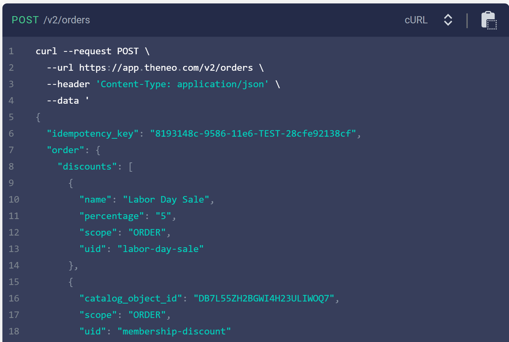{width="6.875757874015748in" height="1.1251235783027123in"}                                                                                                                                                                                                                                                                                    |                                                                                   |
+----------------------------------------------------------------------------------------------------------------------------------------------------------------------------------------------------------------------------------------------------------------------------------------------------------------------------------------------------------------------+-----------------------------------------------------------------------------------+
| # Create order                                                                                                                                                                                                                                                                                                                                                       |                                                                                   |
|                                                                                                                                                                                                                                                                                                                                                                      |                                                                                   |
| **POST** /v2/orders\                                                                                                                                                                                                                                                                                                                                                 |                                                                                   |
| Creates a new order that can include information about products for purchase and settings to apply to the purchase.                                                                                                                                                                                                                                                  |                                                                                   |
|                                                                                                                                                                                                                                                                                                                                                                      |                                                                                   |
| To pay for a created order, see Pay for Orders.                                                                                                                                                                                                                                                                                                                      |                                                                                   |
|                                                                                                                                                                                                                                                                                                                                                                      |                                                                                   |
| You can modify open orders using the UpdateOrder endpoint.                                                                                                                                                                                                                                                                                                           |                                                                                   |
|                                                                                                                                                                                                                                                                                                                                                                      |                                                                                   |
| order^order^     The order to create. if this field is set, the only other top-level field that can be set is the idempotency_key                                                                                                                                                                                                                                    |                                                                                   |
|                                                                                                                                                                                                                                                                                                                                                                      |                                                                                   |
| idempotency_key^string^    A value you specify that uniquely identifies this order among orders you have created. If you are unsure whether a particular order was created successfully, you can try it again with the same idempotency key without worrying about creating duplicate orders. Max Length 192.                                                        |                                                                                   |
|                                                                                                                                                                                                                                                                                                                                                                      |                                                                                   |
| {width="6.861866797900262in" height="4.611619641294838in"}                                                                                                                                                                                                                                                                                     |                                                                                   |
|                                                                                                                                                                                                                                                                                                                                                                      |                                                                                   |
| 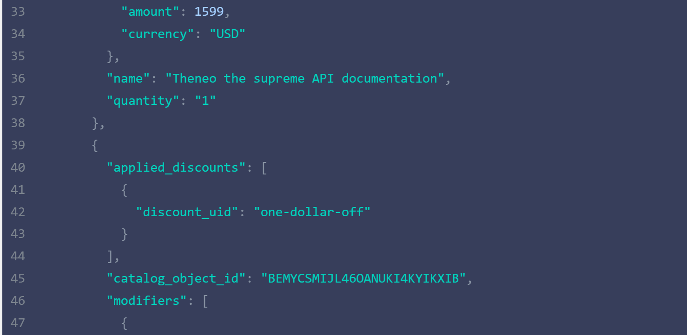{width="6.8526071741032375in" height="3.153125546806649in"}                                                                                                                                                                                                                                                                                    |                                                                                   |
|                                                                                                                                                                                                                                                                                                                                                                      |                                                                                   |
| 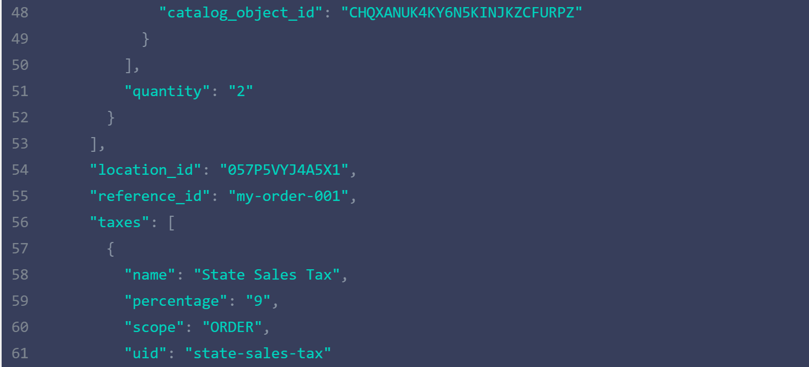{width="6.843346456692913in" height="3.3429615048118984in"}                                                                                                                                                                                                                                                                                    |                                                                                   |
|                                                                                                                                                                                                                                                                                                                                                                      |                                                                                   |
| {width="6.843346456692913in" height="3.111454505686789in"}                                                                                                                                                                                                                                                                                     |                                                                                   |
|                                                                                                                                                                                                                                                                                                                                                                      |                                                                                   |
| 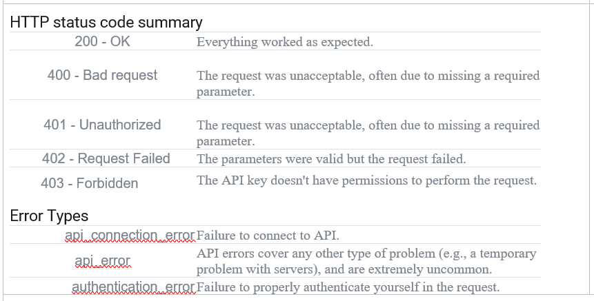{width="6.8526071741032375in" height="1.1251235783027123in"}                                                                                                                                                                                                                                                                                   |                                                                                   |
+----------------------------------------------------------------------------------------------------------------------------------------------------------------------------------------------------------------------------------------------------------------------------------------------------------------------------------------------------------------------+-----------------------------------------------------------------------------------+
| # Errors                                                                                                                                                                                                                                                                                                                                                             |                                                                                   |
|                                                                                                                                                                                                                                                                                                                                                                      |                                                                                   |
| Theneo uses conventional HTTP response codes to indicate the success or failure of an API request. In general: Codes in the2xx range indicate success. Codes in the 4xx range indicate an error that failed given the information provided (e.g., a required parameter was omitted, a charge failed, etc.). Codes in the 5xx range indicate an error with the server |                                                                                   |
|                                                                                                                                                                                                                                                                                                                                                                      |                                                                                   |
| HTTP status code summary                                                                                                                                                                                                                                                                                                                                             |                                                                                   |
|                                                                                                                                                                                                                                                                                                                                                                      |                                                                                   |
| {width="7.175in" height="3.6416666666666666in"}                                                                                                                                                                                                                                                                                                |                                                                                   |
+----------------------------------------------------------------------------------------------------------------------------------------------------------------------------------------------------------------------------------------------------------------------------------------------------------------------------------------------------------------------+-----------------------------------------------------------------------------------+
| # SDK Example                                                                                                                                                                                                                                                                                                                                                        |                                                                                   |
|                                                                                                                                                                                                                                                                                                                                                                      |                                                                                   |
| You can use Theneo for SDKs as well, here is an example .                                                                                                                                                                                                                                                                                                            |                                                                                   |
|                                                                                                                                                                                                                                                                                                                                                                      |                                                                                   |
| The Twilio PHP SDK makes it easy to interact with the Twilio API from your PHP application. The most recent version of\                                                                                                                                                                                                                                              |                                                                                   |
| the Twilio PHP SDK can be found on Packagist. The Twilio SDK requires PHP version 7.2 or higher. The 6.x version of the\                                                                                                                                                                                                                                             |                                                                                   |
| Twilio PHP SDK is API-compatible with the previous 5.x version. If you are interested in migrating to the 5.x version of the\                                                                                                                                                                                                                                        |                                                                                   |
| Twilio PHP SDK from the 4.x version, check out this guide.                                                                                                                                                                                                                                                                                                           |                                                                                   |
|                                                                                                                                                                                                                                                                                                                                                                      |                                                                                   |
| The recommended method for installing the SDK is via Composer. You can add the PHP SDK to your composer.json file\                                                                                                                                                                                                                                                   |                                                                                   |
| with the require command.                                                                                                                                                                                                                                                                                                                                            |                                                                                   |
|                                                                                                                                                                                                                                                                                                                                                                      |                                                                                   |
| composer require twilio/sdk                                                                                                                                                                                                                                                                                                                                          |                                                                                   |
|                                                                                                                                                                                                                                                                                                                                                                      |                                                                                   |
|                                                                                                                                                                                                                                                                                                                                                                      |                                                                                   |
|                                                                                                                                                                                                                                                                                                                                                                      |                                                                                   |
| If you are using a framework like Laravel, the Twilio SDK may be automatically loaded for you and ready to use in your\                                                                                                                                                                                                                                              |                                                                                   |
| application. If you\'re using Composer in an environment that doesn\'t handle autoloading, you can require the autoload file\                                                                                                                                                                                                                                        |                                                                                   |
| from the \"vendor\" directory created by Composer if you used the install command above. Here is a basic example of\                                                                                                                                                                                                                                                 |                                                                                   |
| using the SDK to send a text message.                                                                                                                                                                                                                                                                                                                                |                                                                                   |
|                                                                                                                                                                                                                                                                                                                                                                      |                                                                                   |
| // Required if your environment does not handle autoloading require \_\_DIR\_\_ . \'/vendor/autoload.php\';\                                                                                                                                                                                                                                                         |                                                                                   |
| // Use the REST API Client to make requests to the Twilio REST API use Twilio\\Rest\\Client;\                                                                                                                                                                                                                                                                        |                                                                                   |
| // Your Account SID and Auth Token from twilio.com/console \$sid = \'ACXXXXXXXXXXXXXXXXXXXXXXXXXXXXXXXX\';\                                                                                                                                                                                                                                                          |                                                                                   |
| \$token = \'your_auth_token\'; \$client = new Client(\$sid, \$token);                                                                                                                                                                                                                                                                                                |                                                                                   |
|                                                                                                                                                                                                                                                                                                                                                                      |                                                                                   |
| // Use the client to do fun stuff like send text messages! \$client-\>messages-\>create( // the number you\'d like\                                                                                                                                                                                                                                                  |                                                                                   |
| to send the message to \'+15558675309\',                                                                                                                                                                                                                                                                                                                             |                                                                                   |
|                                                                                                                                                                                                                                                                                                                                                                      |                                                                                   |
| \[                                                                                                                                                                                                                                                                                                                                                                   |                                                                                   |
|                                                                                                                                                                                                                                                                                                                                                                      |                                                                                   |
| // A Twilio phone number you purchased at twilio.com/console \'from\' =\> \'+15017250604\', // the body of\                                                                                                                                                                                                                                                          |                                                                                   |
| the text message you\'d like to send \'body\' =\> \'Hey Jenny! Good luck on the bar exam!\'                                                                                                                                                                                                                                                                          |                                                                                   |
|                                                                                                                                                                                                                                                                                                                                                                      |                                                                                   |
| \]                                                                                                                                                                                                                                                                                                                                                                   |                                                                                   |
|                                                                                                                                                                                                                                                                                                                                                                      |                                                                                   |
| **Using without Composer**                                                                                                                                                                                                                                                                                                                                           |                                                                                   |
|                                                                                                                                                                                                                                                                                                                                                                      |                                                                                   |
| While we recommend using a package manager to track the dependencies in your application, it is possible to download\                                                                                                                                                                                                                                                |                                                                                   |
| and use the PHP SDK manually. You can download the full source of the PHP SDK from GitHub, and browse the repo if\                                                                                                                                                                                                                                                   |                                                                                   |
| you would like. To use the SDK in your application, unzip the SDK download file in the same directory as your PHP code.\                                                                                                                                                                                                                                             |                                                                                   |
| In your code, you can then require the autoload file bundled with the SDK.                                                                                                                                                                                                                                                                                           |                                                                                   |
|                                                                                                                                                                                                                                                                                                                                                                      |                                                                                   |
|                                                                                                                                                                                                                                                                                                                                                                      |                                                                                   |
|                                                                                                                                                                                                                                                                                                                                                                      |                                                                                   |
| // Require the bundled autoload file - the path may need to change // based on where you downloaded and unzipped\                                                                                                                                                                                                                                                    |                                                                                   |
| the SDK require \_\_DIR\_\_ . \'/twilio-php-main/src/Twilio/autoload.php\'; // Use the REST API Client to make requests\                                                                                                                                                                                                                                             |                                                                                   |
| to the Twilio REST API use Twilio\\Rest\\Client; // Your Account SID and Auth Token from twilio.com/console \$sid =\                                                                                                                                                                                                                                                 |                                                                                   |
| \'ACXXXXXXXXXXXXXXXXXXXXXXXXXXXXXXXX\'; \$token = \'your_auth_token\'; \$client = new Client(\$sid, \$token);                                                                                                                                                                                                                                                        |                                                                                   |
|                                                                                                                                                                                                                                                                                                                                                                      |                                                                                   |
| // Use the client to do fun stuff like send text messages! \$client-\>messages-\>create( // the number you\'d like to\                                                                                                                                                                                                                                               |                                                                                   |
| send the message to \'+15558675309\',                                                                                                                                                                                                                                                                                                                                |                                                                                   |
|                                                                                                                                                                                                                                                                                                                                                                      |                                                                                   |
| \[                                                                                                                                                                                                                                                                                                                                                                   |                                                                                   |
|                                                                                                                                                                                                                                                                                                                                                                      |                                                                                   |
| // A Twilio phone number you purchased at twilio.com/console \'from\' =\> \'+15017250604\', // the body of the\                                                                                                                                                                                                                                                      |                                                                                   |
| text message you\'d like to send \'body\' =\> \"Hey Jenny! Good luck on the bar exam!\"                                                                                                                                                                                                                                                                              |                                                                                   |
|                                                                                                                                                                                                                                                                                                                                                                      |                                                                                   |
| \]                                                                                                                                                                                                                                                                                                                                                                   |                                                                                   |
|                                                                                                                                                                                                                                                                                                                                                                      |                                                                                   |
| );                                                                                                                                                                                                                                                                                                                                                                   |                                                                                   |
+----------------------------------------------------------------------------------------------------------------------------------------------------------------------------------------------------------------------------------------------------------------------------------------------------------------------------------------------------------------------+-----------------------------------------------------------------------------------+
